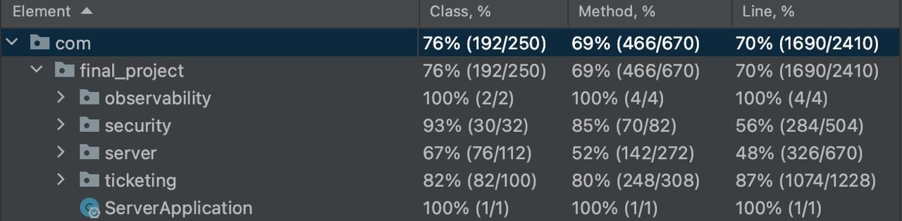

# Final Project - Team28

| Student | Major | ID | email |
|:--:|:--:|:--:|:--:|
| Manuel Enrique Colotti | Cybersecurity | s297014 | manuelenrique.colotti@studenti.polito.it |
| Edoardo Colella | Software Engineering | s305951 | edoardo.colella@studenti.polito.it |
| Davide Arcolini | Cybersecurity | s295229 | davidearcolini.99@gmaiul.com |
| Juan José Jaramillo Botero | Software Engineering | 301352 | 301352@studenti.polito.it |

## About this repo

This repository contains the source code developed to deploy the **Ticketing Service** application. It consists of the following directories: 

- **docker**: it contains the configuration files used to dockerize all the microservices of the application. The `docker-compose.yaml` defines how all the components are integrated in the application.
- **design**: it contains the classes and schema documents, along with the OpenAPI Swagger documentation of the APIs.
- **client**: it contains the source code of the React client application, exposing the web interface to interact with the backend. 
- **server**: it contains the source code of the Kotlin Spring Boot server application, defining and exposing the APIs used to manage products, tickets and messages.
- **images**: it contains the images used in this README.

## About the application

**Ticketing Service** is a **Web Application** that facilitates the management of products, tickets, and messages. It enables customers to raise tickets for issues related to products and get expert assistance. Experts are registered in the system and assigned to specific tickets to provide timely support. Managers have the authority to create new expert instances in the system.

### Tests result

To assert the correctness of the exposed APIs in the `ticketing-service` backend, a test suite has been developed in Spring Boot. The results of the running is presented here:



### Structure of the application

The web application has the following components:
- the **SpringBoot backend** service running with Gradle and exposing the required APIs on port 8081;
- the **React client** running with Node and exposing the user interface on port 3000;
- the **PostgreSQL database** containerized and deployed with a docker-compose configuration file. The PostgreSQL instance is listening on port 5432.
- the **Keycloak IAM** service, running on port 8080, manages user registrations and authentications.
- the **Loki** service, used to store and index logs efficiently.
- the **Grafana** service, running at port 3333, used to visualize the logs collected by Loki. The dashboard used is Spring Boot Observability.
- the **Prometheus** service, used to scrape and store metrics.

## The Keycloak IAM

### Configuration
In our Keycloak instance we have created an additional realm called `TicketingServiceRealm` that will be responsible for the  management of the users and clients of our ticketing service. In this realm, we have also set up:
- a client that will manage the interactions with the ticketing service, called: `ticketing-service-client`.
- a user `admin` that the keycloak client will exploit to communicate with our keycloak instance.

### Authentication endpoints
We have defined and implemented the following endpoints to register and login into the application:
- `POST /api/auth/register`  \
  This endpoint, upon receiving user information, will automatically save the user onto keycloak and once the process is completed, the same user will also be saved on our PostgreSQL instance.
  The logical connection between the Keycloak user and the PostgreSQL user is obtained through the `UUID` generated by Keycloak and also saved on our database.
- `POST /api/auth/login` \
  This endpoint, upon receiving user's credentials, will interact with Keycloak to check the correctness of the user's credentials. If the authentication process is successful, the user will receive a **JWT** `accessToken` that will be used to authenticate the upcoming requests to the other APIs.

### Expert endpoints
Definition and implementation of required expert endpoint was added to allow registered managers to create new expert instances:
- `POST /api/auth/createExpert` \
  This endpoint, upon receiving expert information, will automatically save the expert onto keycloak and once the process is completed, the same expert will also be saved on our PostgreSQL instance.
  The logical connection between the Keycloak expert and the PostgreSQL expert is obtained through the `UUID` generated by Keycloak and also saved on our database.

### Monitoring and obserbavility
The application utilizes an observability stack consisting of multiple tools that provide valuable insights into its performance and behavior. The stack includes the following components:

#### Grafana:
 Serves as a centralized dashboard for monitoring and analyzing various metrics and data from the application. By accessing Grafana at http://localhost:3333, you can explore the "Spring Boot Observability V2" dashboard specifically designed to display relevant metrics.

#### Tempo:
 It allows you to capture and analyze the flow of requests across the application's components and microservices. Tempo provides valuable insights into latency, dependencies, and performance bottlenecks.

#### Loki: 
It collects logs from different sources, including the application, and provides a powerful query language for searching and analyzing log data. Loki simplifies log management, making it easier to identify and troubleshoot issues by examining relevant logs.

Within the application's controllers, specific logging practices are followed. Only generic errors such as authentication and authorization issues are logged. This approach ensures that crucial security-related events are captured for auditing purposes and helps in identifying and resolving potential security vulnerabilities.

#### Prometheus:
 It collects and stores metrics from various sources, including the application, and provides a flexible querying language for analyzing and visualizing metrics data. Prometheus enables proactive monitoring, alerting, and capacity planning by tracking key performance indicators.

To set up the monitoring and observability stack, the following guide was followed:[Spring Boot 3 Observability: Monitor Application on the Method Level](https://medium.com/spring-boot/spring-boot-3-observability-monitor-application-on-the-method-level-8057abec5926). The provided Docker Compose configuration enables the deployment of the monitoring stack, while the inclusion of Micrometer dependencies in the application allows for the seamless transmission of data to the observability stack.

## Deployment
The application has been deployed as a set of microservices on docker-compose. Every custom image we are using is retrieved from our personal repository on Docker Hub.

### Run the application

To run the application:

1. Start the TicketService instance (in *detached* mode) with:
   
    ```
    cd docker
    docker-compose up -d
    ```
2. Access the web application with any browser by reaching `localhost:3000`.


## Credentials for customers, experts and managers
### Customers
| **Username** | **Password** |
|:--:|:--:|
| customer-test-1 | customer-test-1 |
| customer-test-2 | customer-test-2 |
| customer-test-3 | customer-test-3 |
| customer-test-4 | customer-test-4 |
| customer-test-5 | customer-test-5 |

### Experts
| **Username** | **Password** |
|:--:|:--:|
| expert-1 | expert-1 |
| expert-2 | expert-2 |
| expert-3 | expert-3 |
| expert-4 | expert-4 |
| expert-5 | expert-5 |
| expert-6 | expert-6 |
| expert-7 | expert-7 |
| expert-8 | expert-8 |
| expert-9 | expert-9 |
| expert-10 | expert-10 |
| expert-11 | expert-11 |
| expert-12 | expert-12 |


### Managers
| **Username** | **Password** |
|:--:|:--:|
| manager-1 | manager-1 |